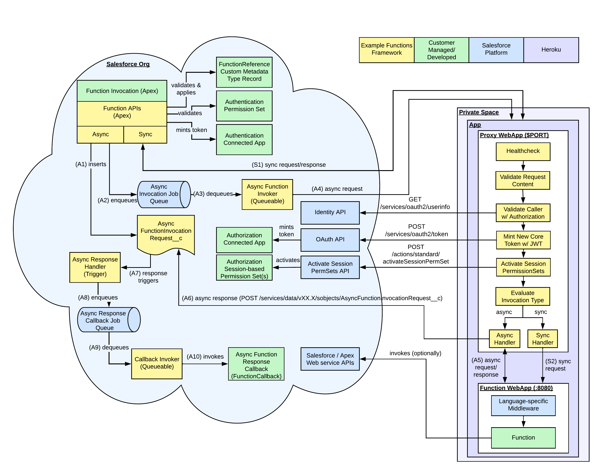

# Functions Migration README

## Introduction

This guide and repository provide an example of how you can port Salesforce Functions to Heroku apps.

The contents of this repository are available for you to modify and use under the Apache License Version 2.0 license. 
See the [LICENSE](https://github.com/heroku/function-migration/blob/main/LICENSE.txt) file for more info.

## Heroku

Heroku is a Platform as a Service based on a managed container system. Heroku has integrated data services and a powerful ecosystem for deploying and running modern apps. 
The Heroku developer experience is an app-centric approach for software delivery that’s integrated with today’s most popular developer tools and workflows.

Heroku makes the process of deploying, configuring, scaling, tuning, and managing apps as simple and straightforward as possible. 
Developers can focus on what’s most important: building great apps that delight and engage customers.

Heroku is required for these example deployments. To gain familiarity with Heroku, see the [How Heroku Works](https://devcenter.heroku.com/articles/how-heroku-works) article in the Heroku Dev Center.

## Salesforce Functions vs. Heroku Apps

The differences between Heroku apps and Salesforce Functions include, but aren’t limited to:

- **Trust Boundary**: Salesforce manages the security for Salesforce Functions ensuring only the authenticated Salesforce org can access. Customers configure and manage the trust boundary for their Heroku apps. Functions aren’t exposed to the internet, while Heroku apps are. You can control access to apps at the network level by using [Heroku Private Spaces](https://devcenter.heroku.com/articles/private-spaces).
- **Scale**: Salesforce Functions has elastic scale. Heroku apps’ scaling is static though customers can manually configure it. [Autoscaling](https://devcenter.heroku.com/articles/scaling#autoscaling) is available only for [Performance-tier dynos](https://devcenter.heroku.com/articles/dyno-types) and dynos running in [Private Spaces](https://devcenter.heroku.com/articles/private-spaces). Additional scaling options are available via [Heroku Add-ons](https://elements.heroku.com/addons).
- **Invocation Time**: Salesforce Functions has a fixed invocation time limit whereas Heroku apps are [long-running](https://devcenter.heroku.com/articles/dynos#automatic-dyno-restarts). 
- **API Limits**: Salesforce Functions has its own API bucket and limits. Standard license-based Salesforce limits, such as API limits, apply to Heroku apps. Syncing data to and from a Salesforce org and Heroku Postgres when using [Heroku Connect](https://elements.heroku.com/addons/herokuconnect) doesn’t count toward Salesforce API limits.
- **Identity**: Salesforce Functions are invoked as the Cloud Integration or Platform Integration User. Heroku app functions are invoked as the invoking Salesforce user.
- **Management**: You can manage Heroku apps via [Heroku Dashboards](https://devcenter.heroku.com/articles/heroku-dashboard) that provide UI support for tasks like configuring apps, viewing app metrics, and viewing usage, invoice, and billing information.
- **Developer Experience**: You can configure and deploy Heroku apps via the [Heroku CLI](https://devcenter.heroku.com/articles/heroku-cli). Heroku apps also have broader [language support](https://www.heroku.com/languages) and have [Heroku Pipelines](https://devcenter.heroku.com/articles/pipelines) for CI/CD.
- **Add-ons**: Heroku apps have a rich inventory of [Heroku Add-ons](https://elements.heroku.com/addons) that provide tools and services for developing, extending, and operating your app.

## Reference Functions Framework

### Overview

The Reference Functions Framework is an example of how to migrate Salesforce Functions to securely run as Heroku apps in [Private Spaces](https://devcenter.heroku.com/articles/private-spaces).

**The Reference Functions Framework is provided as-is and is not supported by Salesforce or Heroku.** 
You can fork the repository and make customizations as needed.

The Reference Functions Framework includes:

- **Connected Apps** for authentication and authorization to create the trust boundary and determine the functions’ Salesforce org access.
- **Apex Classes** and an **Apex Trigger** as APIs to invoke functions, supporting both synchronous and asynchronous invocation.
- A new **Custom Metadata Type**, `FunctionReference__mdt`, that represents deployed, invocable functions.
- A new **Custom Object**, `AsyncFunctionInvocationRequest__c`, that tracks asynchronous requests and handles asynchronous responses.
- **Language-specific proxies**, `Java` and `Node`, that are deployed with functions to validate, enrich, and manage function requests.

### Architecture

The following diagram shows how Reference Functions Framework components interact with functions deployed as Heroku apps.

- **Orange** boxes indicate Reference Functions Framework components provided in this repository.
- **Green** boxes indicate customer setup or developed components that implement Reference Functions Framework APIs and function code.
- **Blue** represents Salesforce Platform APIs and features.
- **Purple** represents the Heroku platform.



Highlights:

>Synchronous requests are Apex callouts to functions. Apex callouts limits apply. See [Callout Limits and Limitations](https://developer.salesforce.com/docs/atlas.en-us.apexcode.meta/apexcode/apex_callouts_timeouts.htm).

>Asynchronous requests are Apex callouts via `@Future`. `@Future` considerations and limits apply. See [Future Methods](https://developer.salesforce.com/docs/atlas.en-us.apexcode.meta/apexcode/apex_invoking_future_methods.htm).

>Function responses are stored in an associated `AsyncFunctionInvocationRequest__c` record. The proxy trigger callback invocation updates the `AsyncFunctionInvocationRequest__c` record response.

>An Apex trigger handles invoking the associated asynchronous callback implementation.

>License-based Salesforce API considerations and limits apply. See [Apex Request Limits and Allocations](https://developer.salesforce.com/docs/atlas.en-us.salesforce_app_limits_cheatsheet.meta/salesforce_app_limits_cheatsheet/salesforce_app_limits_platform_api.htm).

The following sections describe the components of the Reference Functions Framework.

### Authentication and Authorization Connected Apps

The Reference Functions Framework requires two [connected apps](https://help.salesforce.com/s/articleView?id=sf.connected_app_overview.htm&type=5): one for authentication and a second for Salesforce org authorization. 
Both connected apps are JWT-based, enabling server-to-server interactions without user input.

The authentication connected app creates a secure trust boundary that ensures that only the authenticated Salesforce org can invoke org-associated functions. 
The authentication connected app’s JWT is signed with a self-signed certificate created via [Certificate and Key Management](https://help.salesforce.com/s/articleView?id=sf.security_keys_creating.htm&type=5) in Setup.

The authorization connected app generates an access token for functions’ Salesforce org access, for example, access to Salesforce APIs. 
The authorization connected app’s JWT is signed using an [RSA SHA256 self-signed certificate](https://developer.salesforce.com/docs/atlas.en-us.sfdx_dev.meta/sfdx_dev/sfdx_dev_auth_key_and_cert.htm).

You can use the same authorization connected app across all functions. To define the capabilities for each function, use separate authorization connected app for each function. 
Follow the Principle of Least Privilege and only authorize a function to access what it needs.

>The Principle of Least Privilege is that a security architecture should be designed so that each entity is 
>granted the minimum system resources and authorizations that the entity needs to perform its function.

For more information, see [OAuth 2.0 JWT Bearer Flow for Server-to-Server Integration](https://help.salesforce.com/s/articleView?id=sf.remoteaccess_oauth_jwt_flow.htm&type=5).

### Apex APIs

The Reference Functions Framework provides Apex classes as APIs to invoke functions.

#### Classes and Trigger

See the [class](https://github.com/heroku/function-migration/tree/main/force-app/main/default/classes/functions) and [trigger](https://github.com/heroku/function-migration/tree/main/force-app/main/default/triggers/functions) file comments for more details.

```bash
force-app/main/default/classes/functions/
├── FunctionCallback.cls
├── FunctionCallbackQueueable.cls
├── Function.cls
├── FunctionErrorType.cls
├── FunctionInvocation.cls
├── FunctionInvocationError.cls
├── FunctionInvocationErrorImpl.cls
├── FunctionInvocationImpl.cls
├── FunctionInvocationRequest.cls
├── FunctionInvocationStatus.cls
├── FunctionsAuthProvider.cls
└── FunctionsMetadataAuthProviderImpl.cls

force-app/main/default/triggers/functions/
└── AsyncResponseHandlerTrigger.trigger
```

#### Functions APIs

The Reference Functions Framework’s `Function` API is similar to Salesforce Functions’ `Function `API. See [Function Class](https://developer.salesforce.com/docs/atlas.en-us.apexref.meta/apexref/apex_class_functions_Function.htm#apex_class_functions_Function).

The `get()` method queries a `FunctionReference__mdt` custom metadata record reference and validates the invocation configuration. 
The validation ensures that the invoking user is assigned to the given session-based permission set.

The Reference Functions Framework doesn’t require a project name as a function qualifier. 
If a Salesforce org’s source and metadata span multiple repositories, you can use a project name to ensure that `FunctionReference__mdt` records are unique.

The `invoke()` method invokes the function and uses metadata provided by the associated `FunctionReference__mdt` record. 
As with Salesforce Functions, if a `FunctionCallback` implementation is given, the function is invoked asynchronously. The `FunctionCallback `callback is involved on function response.

Apex’s callout considerations and limits apply. See [Invoking Callouts Using Apex](https://developer.salesforce.com/docs/atlas.en-us.apexcode.meta/apexcode/apex_callouts.htm) and [Callout Limits and Limitations](https://developer.salesforce.com/docs/atlas.en-us.apexcode.meta/apexcode/apex_callouts_timeouts.htm).

Example `get()`, synchronous and asynchronous `invoke()`, and asynchronous callback:

```java
// Invoke sync function
public static void invokeSync() {
    // Get reference to function
    Function javafunction = Function.get('sfhxhello_javafunction');
    Map<String,String> params = new Map<String,String>();

    // Invoke sync...
    FunctionInvocation invocation = javafunction.invoke(JSON.serialize(params));
}

// Invoke async function
public static void invokeSync() {
    // Get FunctionReference__mdt record w/ given reference
    Function javafunction = Function.get('mynamespace', 'sfhxhello_javafunction');
    Map<String,String> params = new Map<String,String>();

    // Aync invoke
    FunctionInvocation invocation = javaFunction.invoke(JSON.serialize(params), new Callback('sfhxhello_javafunction'));
}

// Callback
public class Callback implements FunctionCallback {
   String functionName;

   Callback(String functionName) {
      this.functionName = functionName;
   }

   public void handleResponse(FunctionInvocation invocation) {
      System.debug(invocation.getStatus().name() + ': ' + invocation.getResponse());
   }
}
```

You can extend the` invoke()` API to include retries for resiliency and durability.

#### FunctionsAuthProvider Apex API

The `FunctionsAuthProvider` API provides an extension on how function authentication tokens are generated per function request.

```
global interface FunctionsAuthProvider {
    String generateFunctionAuthenticationToken();
}
```

The default `FunctionsMetadataAuthProviderImpl` implementation generates an access token via a configured authentication connected app referenced by the `ConsumerKey__c` and `Certificate__c` fields in `FunctionReference__mdt`. 
The `ConsumerKey__c` and `Certificate__c `values reference the authentication connected app and its JWT created via Certificate and Key Management in Setup.

#### FunctionReferenceProvider Apex API

The Reference Functions Framework’s `FunctionReferenceProvider `API provides an extension on how function metadata, required by `get()` and `invoke()`, is retrieved and managed.

The default `FunctionReferenceMetadataProviderImpl` implementation queries for `FunctionReference__mdt `records.

Alternative approaches are to implement a `FunctionReferenceProvider` provider that invokes [Heroku APIs](https://devcenter.heroku.com/articles/platform-api-reference) to return required metadata, such as the function’s URL. 
Or you can implement External Objects to represent Heroku primitives, such as App, to query function endpoint URLs via Heroku’s [App Info](https://devcenter.heroku.com/articles/platform-api-reference#app-info) API.

You can also extend `FunctionReferenceMetadataProviderImpl` or implement a custom `FunctionReferenceProvider` to cache function metadata Salesforce Platform's [Platform Cache](https://developer.salesforce.com/docs/atlas.en-us.apexcode.meta/apexcode/apex_cache_namespace_overview.htm).

### FunctionReference__mdt Custom Metadata Type

Metadata enables customers and partners to extend, expose to admins, package, and progress their Platform apps between deployment environments.

`FunctionReference__mdt `custom metadata type records represent deployed, invocable actions. The fields include:

- **Endpoint__c**: The URL of a function. Function endpoints change per deployment environment. For example, scratch, sandbox, and production orgs each have their own deployed function and function URL.
- **PermissionSetOrGroup__c**: The session-based permission set API name activated on the function’s token grant function access. If applicable, include the namespace, for example, `mynamespace__MyPermissionSet`. Assign this permission set to users who invoke functions.
- **ConsumerKey__c**: The consumer key of the [authentication connected app](https://github.com/heroku/function-migration/blob/main/MIGRATION.md#7-create-an-authentication-connected-app) that `FunctionsMetadataAuthProviderImpl` uses to generate an access token. This token is used by the proxy to authenticate function requests.
- **Certificate__c**: The certificate name associated with the authentication connected app. This certficate is created via Certificates and Keys in Setup. `FunctionsMetadataAuthProviderImpl` uses the certificate to generate an access token for the proxy to authenticate function requests.

Change the `FunctionReference__mdt` custom metadata type field values per deployment environment. The code stays the same, but the metadata changes. For example, stage-specific, scratch, sandbox, and production function endpoints change.

For each function, create a `FunctionReference__mdt` custom metadata type record:

```bash
# If you have already deployed your app, get the app URL from Heroku 
$ heroku apps:info -s  | grep web_url | cut -d= -f2
https://javafunction.herokuapp.com/
# Use this URL as the function's FunctionReference.Endpoint__c.
# If you have not yet deployed, be sure to name your app to match the Endpoint reference.
```

#### Example

```bash
$ cat force-app/main/default/customMetadata/FunctionReference.sfhxhello_javafunction.md-meta.xml
<?xml version="1.0" encoding="UTF-8"?>
<CustomMetadata xmlns="http://soap.sforce.com/2006/04/metadata" xmlns:xsi="http://www.w3.org/2001/XMLSchema-instance" xmlns:xsd="http://www.w3.org/2001/XMLSchema">
    <label>Java Function</label>
    <protected>false</protected>
    <values>
        <field>Endpoint__c</field>
        <value xsi:type="xsd:string">https://javafunction.herokuapp.com</value>
    </values>
    <values>
        <field>PermissionSetOrGroup__c</field>
        <value xsi:type="xsd:string">JavaFunction</value>
    </values>
    <values>
        <field>ConsumerKey__c</field>
        <value xsi:type="xsd:string">3MVG9i...</value>
    </values>
    <values>
        <field>Certificate__c</field>
        <value xsi:type="xsd:string">Functions_Internal_Cert</value>
    </values>
</CustomMetadata>
```

The Reference Functions Framework queries the `FunctionReference__mdt` record for each `Functions.get(<function name>)` call. 
The `get()` API validates the reference, validates that the configured `PermissionSetOrGroup__c` exists, if it’s provided. 
It ensures that the invoking user is assigned. `invoke()` uses the `Endpoint__c` value to invoke the function.

`PermissionSetOrGroup__c `is optional, but you must assign invoking users **Edit** access to `AsyncFunctionInvocationRequest__c`. See [AsyncFunctionInvocationRequest__c Custom Object](https://github.com/heroku/function-migration/blob/main/README.md#asyncfunctioninvocationrequest__c-custom-object).

### AsyncFunctionInvocationRequest__c Custom Object

The `AsyncFunctionInvocationRequest__c` custom object manages and tracks asynchronous function invocations.

On async invocation, it creates a `AsyncFunctionInvocationRequest__c` record and passes its `Id` in the function request. 
On asynchronous request, the proxy captures the function’s response or failure. After a `AsyncFunctionInvocationRequest__c` record updates, the `AsyncResponseHandlerTrigger` trigger invokes the given, stored `FunctionCallback` implementation.

A `StatusCode__c` value of `500` generally means an error occurred in the function. A `StatusCode__c` of `503` generally means an error occurred in the Reference Functions Framework, within Salesforce, Heroku, or somewhere in -between.

>**Note** 
>[Delete](https://help.salesforce.com/s/articleView?id=sf.basics_deleting_records.htm&type=5) `AsyncFunctionInvocationRequest__c `records regularly to ensure efficient Salesforce org storage.

```
force-app/main/default/objects/AsyncFunctionInvocationRequest__c/
├── AsyncFunctionInvocationRequest__c.object-meta.xml
└── fields
    ├── Callback__c.field-meta.xml      // Serialized Apex callback object
    ├── CallbackType__c.field-meta.xml  // Apex callback class name
    ├── Context__c.field-meta.xml       // Function and Salesforce contexts of request
    ├── ExtraInfo__c.field-meta.xml     // URL encode extra info about a function invocation, eg execution time (ms) and function stacktrace on error
    ├── Request__c.field-meta.xml       // Function request payload
    ├── RequestId__c.field-meta.xml     // Function request request UUID
    ├── Response__c.field-meta.xml      // Function response
    ├── Status__c.field-meta.xml        // Status of function request
    └── StatusCode__c.field-meta.xml    // HTTP status code of function request
```

You must assign **Edit** access to `AsyncFunctionInvocationRequest__c` for invoking users. You can do so either with the `FunctionReference.PermissionSetOrGroup__c`‘s permission set or another permission set.

## Proxy

A Heroku app function consists of 2 web apps: a language-specific proxy web app provided by the Reference Functions Framework that listens on the external port, and the function web app that accepts requests only from the proxy.

For **synchronous** requests, the proxy:

1. Validates the request payload and ensures that the caller is from the authenticated Salesforce org.
2. Adds to the function payload:
    1. Creates an org-accessible token for the function as the invoking Salesforce user using the authentication connected app.
    2. Activates given session-based permission sets on the function’s token, if applicable.
3. Forwards the request to the function.


For **asynchronous** requests, the proxy:

1. Validates the request payload and ensures that the caller is from the authenticated Salesforce org.
2. Adds to the function payload:
    1. Creates an org-accessible token for the function as the invoking Salesforce user using the authentication connected app.
    2. Activates given session-based permission sets on the function’s token, if applicable.
3. Disconnects from the client sending a `201` response.
4. Invokes the function with the enriches request.
5. Handles the function’s response updating the associated `AsyncFunctionInvocationRequest__c` record.

You can configure secure references to the authorization connected app and its JWT for the proxy as [Heroku config vars](https://devcenter.heroku.com/articles/config-vars).

The `javafunction/proxy` and `typescriptfunction/proxy` directories provide the Reference Functions Framework proxies for `Java` and `Node`, respectively.

For more information, see language-specific proxies:
- [Java](functions/javafunction/README.md)
- [Node](functions/typescriptfunction/README.md)

## Function Invocation Request Schema

The function invocation payload schema follows the [CloudEvents](https://cloudevents.io/) specification that describes event data in a consistent, accessible, and protable way.

The function invocation request payload includes:

- Top-level metadata as request headers defined by CloudEvents' [HTTP Protocol Binding - Version 1.0](https://github.com/cloudevents/spec/blob/v1.0/http-protocol-binding.md).
- Context of the function request the proxy uses to validate, authenticate, and authorize requests. Function invocation request context is base64 encoded and set on the request as ce-sffncontext header extension per CloudEvents' HTTP Protocol Binding schema. See example below.
- Salesforce context the proxy uses to validate, authenticate, and authorize requests and by functions representing the invoking Salesforce org. The Salesforce invocation request context is base64 encoded and set on the request as ce-sfcontext header extension per CloudEvents' HTTP Protocol Binding schema. See example below.
- Function payloads are sent as the body of the request.

Example of a function invocation request following CloudEvents' HTTP Protocol Binding specification:

```bash
-H "ce-specversion: 1.0" \
-H "ce-id: 00Dxx0000006IYJEA2-4Y4W3Lw_LkoskcHdEaZze-a00xx000000bxi1AAA-MyFunction-2020-09-03T20:56:27.608444Z" \
-H "ce-source: urn:event:from:salesforce/xx/00Dxx0000006IYJEA2/apex" \
-H "ce-datacontenttype: application/json" \
-H "ce-type: com.salesforce.function.invoke.sync" \
-H "ce-sffncontext: ..." \
-H "ce-sfcontext: ..." \
-d '{\"Hello\":\"There!\"}'
```
Example of function invocation request context set on request as 'ce-sffncontext' header, base64 encoded:

```json
{
  "id": "00Dxx0000006IYJEA2-4Y4W3Lw_LkoskcHdEaZze-uuid-MyFunction-2023-03-23T15:18:53.429-0700",
  "functionName": "MyFunction",
  "resource": "https://...",
  "source": "urn:event:from:salesforce/<instance>/<orgId>/<platform origin, eg apex>",
  "type": "com.salesforce.function.invoke.sync",
  "requestTime": "2023-03-23T15:18:53.429-0700",
  "functionInvocationId": "<AsyncFunctionInvocationRequest__c.ID>",
  "permissionSets": "[ 'MyPermissionSet' ]"
}
```
Example of the context of the invoking Salesforce org set on request as "ce-sfcontext" header, base64 encoded:

```json
{
  "apiVersion": "57.0",
  "payloadVersion": "0.1",
  "userContext": {
    "orgId": "00Dxx0000006IYJ",
    "userId": "005xx000001X8Uz",
    "username": "admin@example.com",
    "salesforceBaseUrl": "https://na1.salesforce.com",
    "orgDomainUrl": "https://mycompany.my.salesforce.com",
    "namespace": "",
  }
}
```

## Migrating Salesforce Functions to Reference Functions Framework

See [Migration to the Reference Functions Framework](MIGRATION.md).
