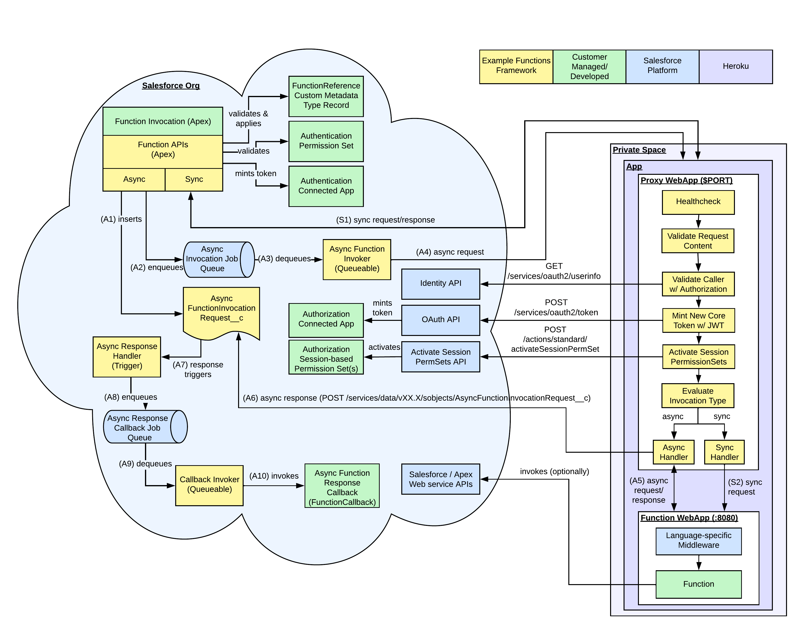

# Salesforce Function Migration

## Introduction
This guide and repository is an example of how Salesforce Functions may be ported to Heroku Apps.

The contents of this repository are available for you to modify and use under the Apache License Version 2.0 license. See 
the LICENSE file for more info.

## Heroku
Heroku is a platform as a service based on a managed container system, with integrated data services and a powerful 
ecosystem for deploying and running modern apps. The Heroku developer experience is an app-centric approach for software 
delivery, integrated with today’s most popular developer tools and workflows.

Heroku makes the processes of deploying, configuring, scaling, tuning, and managing apps as simple and straightforward 
as possible, so that developers can focus on what’s most important: building great apps that delight and engage customers.

Deploying and maintaining apps should be frictionless, and these capabilities should be a part of a company's DNA.

Using Heroku is required for these example deployments and if you are not familiar with how it works, please see 
the [How Heroku Works](https://devcenter.heroku.com/articles/how-heroku-works) article at the Heroku DevCenter.

## Salesforce Functions vs. Heroku Apps
Heroku Apps differ from Salesforce Functions including, but not limited to:
- **Trust Boundary** - Salesforce Functions is Salesforce-managed secured ensuring only the owning Organization may access.  Heroku Apps' trust boundary are customer configured and managed.  Functions are not exposed to the internet, Heroku Apps are.
- **Scale** - Salesforce Functions have elastic scale.  Heroku Apps' scale is manually configured and static.  Autoscaling is available only for Performance-tier dynos and dynos running in Private Spaces.  Additional scaling options are available via Heroku Add-ons.
- **Limits** - Salesforce Functions have fixed invocation time limit whereas Heroku Apps are long-running.  Salesforce Functions has its own API bucket and limit.  Standard licensed-based Salesforce limits such as API limits apply to Heroku Apps. 
- **Identity** - Salesforce Functions are invoked as the Cloud Integration or Platform Integration User.  Heroku App functions are invoked as the invoking Salesforce user.
- **Management** - Heroku Apps are managed via [Heroku Dashboards](https://devcenter.heroku.com/articles/heroku-dashboard) that provide Admin-centric capabilities such as configuring Apps, viewing App metrics, and viewing usage, invoice, and billing information.
- **Developer Experience** - Heroku Apps are configured and deployed via the [Heroku CLI](https://devcenter.heroku.com/articles/heroku-cli) and have broader [language support](https://www.heroku.com/languages).  Heroku Apps have [Heroku Pipelines](https://devcenter.heroku.com/articles/pipelines) for CI/CD.
- **Add-ons** - Heroku Apps have a rich inventory of [Heroku Add-ons](https://elements.heroku.com/addons) that provide tools and services for developing, extending, and operating your App.

## Reference Functions Framework

### Overview
The Reference Functions Framework is an example of how to lift-and-shift Salesforce Functions to run securely as 
Heroku Apps in [Private Spaces](https://devcenter.heroku.com/articles/private-spaces).

**The Reference Functions Framework is as-is and not supported by Salesforce or Heroku.**  You may fork the repository 
and make customizations as needed.

The Reference Functions Framework includes:
- **Connected Apps** for authentication (trust boundary) and authorization (determines functions' Organization access).
- **Apex Classes** and an **Apex Trigger** as APIs to invoke functions, supporting both synchronous and asynchronous invocation.
- A new **Custom Metadata Type** (`FunctionReference__mdt`) representing deployed, invocable functions.
- A new **Custom Object** (`AsyncFunctionInvocationRequest__c`) that tracks asynchronous requests and handles asynchronous responses.
- **Language-specific proxies** (`Java` and `Node`) are deployed alongside and in front of a function to validate, enrich, and manage function requests.

### Architecture
The following diagram shows how Reference Functions Framework components interact with functions deployed as Heroku Apps.
- **Orange** boxes indicated Reference Functions Framework components provided in this repository.  
- **Green** boxes indicate customer set up or developed components that implement Reference Functions Framework APIs and function code. 
- **Blue** represents Salesforce Platform APIs and features.
- **Purple** represents the Heroku Platform.



Notes:

> Synchronous requests are Apex callouts to functions.  Apex callout limits apply, see [Callout Limits and Limitations](https://developer.salesforce.com/docs/atlas.en-us.apexcode.meta/apexcode/apex_callouts_timeouts.htm).

> Asynchronous requests are Apex callouts via `@Future`.  `@Future` considerations and limits apply, see [Future Methods](https://developer.salesforce.com/docs/atlas.en-us.apexcode.meta/apexcode/apex_invoking_future_methods.htm).

> Function responses are stored in an associated `AsyncFunctionInvocationRequest__c` record.  `AsyncFunctionInvocationRequest__c` record response updates by the proxy trigger callback invocation.
 
> An Apex Trigger handles invoking the associated asynchronous callback implementation.

> License-based Salesforce API considerations and limits 
([API Request Limits and Allocations](https://developer.salesforce.com/docs/atlas.en-us.salesforce_app_limits_cheatsheet.meta/salesforce_app_limits_cheatsheet/salesforce_app_limits_platform_api.htm)) apply.

The sections below describe components of the Reference Functions Framework.

### Authentication and Authorization Connected Apps
Two (2) Connected Apps are required by the Reference Functions Framework: one for function request authentication and 
a second for functions' Organization authorization.  Both Connected Apps are JWT-based enabling server-to-server 
interactions without user input. 

The authentication Connected App creates a secure trust boundary ensuring that only the "owning" Organization can invoke
Organization-associated functions.  The authentication Connected App's JWT is signed with a self-signed certificate 
created via Setup's Certificate and Key Management.

The authorization Connected App is used by the proxy to generate an access token for functions' Organization access 
(eg, Salesforce APIs).  The authorization Connected App's JWT is signed using a RSA SHA256 self-signed certificate.

The authorization Connected App may be used across all functions.  However, a separate Connected App per-function for 
authorization enables each function to have its own capabilities defined.  A function should only be authorized access 
to what it needs, nothing more.  This follows the Principle of Least Privilege, defined below.

> The Principle of Least Privilege is that a security architecture should be designed so that each entity is granted 
> the minimum system resources and authorizations that the entity needs to perform its function.

For more information, see [OAuth 2.0 JWT Bearer Flow for Server-to-Server Integration](https://help.salesforce.com/s/articleView?id=sf.remoteaccess_oauth_jwt_flow.htm&type=5).

### Apex APIs
The Reference Functions Framework provides Apex classes as APIs to invoke functions.

#### Classes and Trigger
See class and trigger file comments for more details.
```bash
force-app/main/default/classes/functions/
├── FunctionCallback.cls
├── FunctionCallbackQueueable.cls
├── Function.cls
├── FunctionErrorType.cls
├── FunctionInvocation.cls
├── FunctionInvocationError.cls
├── FunctionInvocationErrorImpl.cls
├── FunctionInvocationImpl.cls
├── FunctionInvocationRequest.cls
├── FunctionInvocationStatus.cls
├── FunctionsAuthProvider.cls
└── FunctionsMetadataAuthProviderImpl.cls

force-app/main/default/triggers/functions/
└── AsyncResponseHandlerTrigger.trigger
```

#### Functions APIs
The Reference Functions Framework's `Function` API is similar to Salesforce Functions' `Function` API, 
see [Function Class](https://developer.salesforce.com/docs/atlas.en-us.apexref.meta/apexref/apex_class_functions_Function.htm#apex_class_functions_Function).

The `get()` method takes a `FunctionReference__mdt` Custom Metadata record reference.  `get()` will query for the 
`FunctionReference__mdt` record and validate the invocation configuration (i.e. ensure that the invoking user is assign to 
the given session-based Permission Set).

Project name as a function qualifier is not required by the Reference Functions Framework.  If an Organization's source 
and metadata span multiple repositories, project name may be used to ensure that `FunctionReference__mdt` records are unique.

The `invoke()` method invokes the function and uses metadata provided by the associated `FunctionReference__mdt` 
record.  As with Salesforce Functions, if a `FunctionCallback` implementation is given, the function will be invoked 
asynchronously.  The `FunctionCallback` callback is invoked on function response.

Apex's callout considerations ([Invoking Callouts Using Apex](https://developer.salesforce.com/docs/atlas.en-us.apexcode.meta/apexcode/apex_callouts.htm)) 
and limits ([Callout Limits and Limitations](https://developer.salesforce.com/docs/atlas.en-us.apexcode.meta/apexcode/apex_callouts_timeouts.htm)) apply.

Example `get()`, synchronous and asynchronous `invoke()`, and asynchronously callback:
```java
// Invoke sync function
public static void invokeSync() {
    // Get reference to function
    Function javafunction = Function.get('sfhxhello_javafunction');
    Map<String,String> params = new Map<String,String>();

    // Invoke sync...
    FunctionInvocation invocation = javafunction.invoke(JSON.serialize(params));
}

// Invoke async function
public static void invokeSync() {
    // Get FunctionReference__mdt record w/ given reference
    Function javafunction = Function.get('mynamespace', 'sfhxhello_javafunction');
    Map<String,String> params = new Map<String,String>();

    // Aync invoke
    FunctionInvocation invocation = javaFunction.invoke(JSON.serialize(params), new Callback('sfhxhello_javafunction'));
}

// Callback
public class Callback implements FunctionCallback {
   String functionName;

   Callback(String functionName) {
      this.functionName = functionName;
   }

   public void handleResponse(FunctionInvocation invocation) {
      System.debug(invocation.getStatus().name() + ': ' + invocation.getResponse());
   }
}
```

The `invoke()` API may be extended to include retries for resiliency and durability. 

#### FunctionsAuthProvider Apex API
The `FunctionsAuthProvider` API provides an extension to how function authentication tokens are generated 
per function request.

```java
global interface FunctionsAuthProvider {
    String generateFunctionAuthenticationToken();
}
```

The default `FunctionsMetadataAuthProviderImpl` implementation generates an access token via a configured authentication 
Connected App referenced by `FunctionReference__mdt` fields `ConsumerKey__c` and `Certificate__c`.  `ConsumerKey__c` and 
`Certificate__c` values reference the authentication Connected App and its JWT, created via Setup's Certificate and Key 
Management.

#### FunctionReferenceProvider Apex API
Reference Functions Framework's `FunctionReferenceProvider` API provides an extension on how function
metadata - required by `get()` and `invoke()` - is retrieved and managed.

The default `FunctionReferenceMetadataProviderImpl` implementation queries for `FunctionReference__mdt` records.

Alternative approaches are to implement a `FunctionReferenceProvider` provider that invokes 
[Heroku APIs](https://devcenter.heroku.com/articles/platform-api-reference) to return required metadata such as the 
functions URL.  Or, External Objects could represent Heroku primitives such as App that are implemented to query metadata, 
for example function endpoint URLs, via the Heroku's [App Info](https://devcenter.heroku.com/articles/platform-api-reference#app-info) API.

Extending `FunctionReferenceMetadataProviderImpl` or a custom `FunctionReferenceProvider` implementation could cache 
function metadata using Salesforce Platform's [Platform Cache](https://developer.salesforce.com/docs/atlas.en-us.apexcode.meta/apexcode/apex_cache_namespace_overview.htm).

### FunctionReference__mdt Custom Metadata Type
Metadata enables customers and partners to extend, expose to Admins, package, and progress their Platform apps from 
deployment environment to deployment environment.

`FunctionReference__mdt` Custom Metadata Type records represent deployed, invocable functions.

Fields:
- **Endpoint__c** - URL of function.  Function endpoints change per deployment environment, eg Scratch, Sandbox, and 
Production Organizations will each have their own deployed function and function URL.
- **PermissionSetOrGroup__c** - session-based Permission Set API name activated on function's token grant function 
access.  If applicable, include namespace, eg `mynamespace__MyPermissionSet`.  Function invoking users are assigned to 
this Permission Set.
- **ConsumerKey__c** - Consumer Key of the authentication Connected App (eg, the "Functions Authentication" 
Connected App create below) used by `FunctionsMetadataAuthProviderImpl` to generate an access token for the proxy to 
authenticate function requests.
- **Certificate__c** - Certificate name, created via Setup's  [Certificates and Keys](https://help.salesforce.com/s/articleView?id=sf.security_keys_about.htm&type=5), 
that is associated with the authentication Connected App (eg, the "Functions Authentication" Connected App create 
below).  The Certificate used by `FunctionsMetadataAuthProviderImpl` to generate an access token for the proxy to 
authenticate function requests.

Change `FunctionReference__mdt` Custom Metadata Type field values per deployment environment.  Code stays the same, 
metadata changes, eg stage-specific (Scratch, Sandbox, etc) function endpoints.

For each function, create a `FunctionReference__mdt` Custom Metadata Type record:
```bash
# If you have already deployed your app, get the app URL from Heroku 
$ heroku apps:info -s  | grep web_url | cut -d= -f2
https://javafunction.herokuapp.com/
# Use this URL as the function's FunctionReference.Endpoint__c.
# If you have not yet deployed, be sure to name your app to match the Endpoint reference.
```

#### Example
```bash
$ cat force-app/main/default/customMetadata/FunctionReference.sfhxhello_javafunction.md-meta.xml
<?xml version="1.0" encoding="UTF-8"?>
<CustomMetadata xmlns="http://soap.sforce.com/2006/04/metadata" xmlns:xsi="http://www.w3.org/2001/XMLSchema-instance" xmlns:xsd="http://www.w3.org/2001/XMLSchema">
    <label>Java Function</label>
    <protected>false</protected>
    <values>
        <field>Endpoint__c</field>
        <value xsi:type="xsd:string">https://javafunction.herokuapp.com</value>
    </values>
    <values>
        <field>PermissionSetOrGroup__c</field>
        <value xsi:type="xsd:string">JavaFunction</value>
    </values>
    <values>
        <field>ConsumerKey__c</field>
        <value xsi:type="xsd:string">3MVG9i...</value>
    </values>
    <values>
        <field>Certificate__c</field>
        <value xsi:type="xsd:string">Functions_Internal_Cert</value>
    </values>
</CustomMetadata>
```

The Reference Functions Framework queries for the `FunctionReference__mdt` record for each `Functions.get(<function name>)` 
call.  The `get()` API validates the reference, validates that the configured `PermissionSetOrGroup__c` exists (if provided) and 
ensures that the invoking user is assigned.  `Endpoint__c` is used by `invoke()` to invoke the function.

`PermissionSetOrGroup__c` is optional, but invoking users must be assigned **Edit** access to 
`AsyncFunctionInvocationRequest__c` (more below).

### AsyncFunctionInvocationRequest__c Custom Object
`AsyncFunctionInvocationRequest__c` Custom Object manages and tracks asynchronous function invocations.

On async invocation, a `AsyncFunctionInvocationRequest__c` record is created and its `Id` passed in the function 
request.  On asynchronous request, the proxy captures the function's response or failure.  Once a 
`AsyncFunctionInvocationRequest__c` record is updated, the `AsyncResponseHandlerTrigger` trigger invokes the given, 
stored `FunctionCallback` implementation.

`StatusCode__c` value of `500` generally means an error occurred in the function.  `StatusCode__c` of `503` generally means 
an error occurred in the Reference Functions Framework, within Salesforce, Heroku, or somewhere in-between. 

> **Note**  
> `AsyncFunctionInvocationRequest__c` records must be deleted on a regular basis to ensure efficient Organization storage.

```bash
force-app/main/default/objects/AsyncFunctionInvocationRequest__c/
├── AsyncFunctionInvocationRequest__c.object-meta.xml
└── fields
    ├── Callback__c.field-meta.xml      // Serialized Apex callback object
    ├── CallbackType__c.field-meta.xml  // Apex callback class name
    ├── Context__c.field-meta.xml       // Function and Salesforce contexts of request
    ├── ExtraInfo__c.field-meta.xml     // URL encode extra info about a function invocation, eg execution time (ms) and function stacktrace on error
    ├── Request__c.field-meta.xml       // Function request payload
    ├── RequestId__c.field-meta.xml     // Function request request UUID
    ├── Response__c.field-meta.xml      // Function response
    ├── Status__c.field-meta.xml        // Status of function request
    └── StatusCode__c.field-meta.xml    // HTTP status code of function request
```

Either via `FunctionReference.PermissionSetOrGroup__c`'s Permission Set or another Permission Set, invoking users must be assigned 
**Edit** access to `AsyncFunctionInvocationRequest__c`.


## Proxy
A Heroku App function consists of 2 webapps - a language-specific proxy webapp - provided by the Reference 
Functions Framework - that listens on the external port and the function webapp that accepts requests only from the proxy.

For **synchronous** requests, the proxy:
1. Validates the request payload and ensures that the caller is from the "owning" Organization.
2. Enriches the function payload:
   1. Mints an Organization-accessible token for the function - using the authentication Connected App - as the invoking Salesforce user.
   2. Activates given session-based Permission Sets on the function's token, if applicable.
3. Forwards the request to the function.

For **asynchronous** requests, the proxy:
1. Validates the request payload and ensures that the caller is from the "owning" Organization.
2. Enriches the function payload:
    1. Mints an Organization-accessible token for the function - using the authentication Connected App - as the invoking Salesforce user.
    2. Activates given session-based Permission Sets on the function's token, if applicable.
3. Disconnects from the client sending a `201` response.
4. Invokes the function with the enriches request.
5. Handles the function's response updating the associate `AsyncFunctionInvocationRequest__c` record.

The proxy is configured with secure references to the authorization Connected App and its JWT, signed using a RSA SHA256 
self-signed certificate, as Heroku config vars.

The Reference Functions Framework proxy for `Java` and `Node` are provided in the `javafunction/proxy` and 
`typescriptfunction/proxy` directories, respectively.

For more information, see language-specific proxy:
- [Java](functions/javafunction/README.md)
- [Node](functions/typescriptfunction/README.md)

## Function Invocation Request Schema
The function invocation payload schema follows the [CloudEvents](https://cloudevents.io/) specification that describes event data in a consistent, accessible, and protable way.

The function invocation request payload includes:
- Top-level metadata as request headers defined by CloudEvents' [HTTP Protocol Binding - Version 1.0](https://github.com/cloudevents/spec/blob/v1.0/http-protocol-binding.md).
- Context of the function request used by the proxy to validate, authenticate, and authorize requests.  Function invocation request context is `base64` encoded and set on the request as `ce-sffncontext` header extension per CloudEvents' HTTP Protocol Binding schema.  See example below.
- Salesforce context used by the proxy to validate, authenticate, and authorize requests and by functions representing the invoking Organization.  The Salesforce invocation request context is `base64` encoded and set on the request as `ce-sfcontext` header extension per CloudEvents' HTTP Protocol Binding schema.  See example below.
- Function payloads are sent as the body of the request.

Example of a function invocation request following CloudEvents' HTTP Protocol Binding specification:
```bash
-H "ce-specversion: 1.0" \
-H "ce-id: 00Dxx0000006IYJEA2-4Y4W3Lw_LkoskcHdEaZze-a00xx000000bxi1AAA-MyFunction-2020-09-03T20:56:27.608444Z" \
-H "ce-source: urn:event:from:salesforce/xx/00Dxx0000006IYJEA2/apex" \
-H "ce-datacontenttype: application/json" \
-H "ce-type: com.salesforce.function.invoke.sync" \
-H "ce-sffncontext: ..." \
-H "ce-sfcontext: ..." \
-d '{\"Hello\":\"There!\"}'
```

Example of function invocation request context set on request as 'ce-sffncontext' header, base64 encoded:
```json
{
  "id": "00Dxx0000006IYJEA2-4Y4W3Lw_LkoskcHdEaZze-uuid-MyFunction-2023-03-23T15:18:53.429-0700",
  "functionName": "MyFunction",
  "resource": "https://...",
  "source": "urn:event:from:salesforce/<instance>/<orgId>/<platform origin, eg apex>",
  "type": "com.salesforce.function.invoke.sync",
  "requestTime": "2023-03-23T15:18:53.429-0700",
  "functionInvocationId": "<AsyncFunctionInvocationRequest__c.ID>",
  "permissionSets": "[ 'MyPermissionSet' ]"
}
```

Example of Salesforce context - context of invoking Organization - set on request as "ce-sfcontext" header, base64 encoded:
```json
{
  "apiVersion": "57.0",
  "payloadVersion": "0.1",
  "userContext": {
    "orgId": "00Dxx0000006IYJ",
    "userId": "005xx000001X8Uz",
    "username": "admin@example.com",
    "salesforceBaseUrl": "https://na1.salesforce.com",
    "orgDomainUrl": "https://mycompany.my.salesforce.com",
    "namespace": "",
  }
}
```

## Migrating Salesforce Functions to Reference Functions Framework
See [Migration to Reference Functions Framework](MIGRATION.md).
